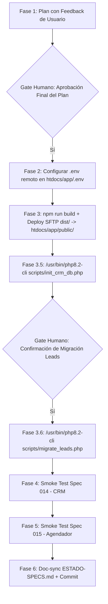

# Plan de Implementación — Retomar Despliegue IONOS post-rotación SSH (Specs 014 + 015)

Extiende **Spec 014 (CRM Lead Lifecycle)** y **Spec 015 (Agendador de Citas)**. Define la estrategia completa y verificada para desplegar el nuevo sitio Astro + backend PHP (CRM + Agendador) en el subdominio dedicado `app.datanestiq.com` sin alterar ni poner en riesgo el sitio WordPress existente en `datanestiq.com`.

---

## Respuestas e Integración de Feedback del Usuario

### 1. Manejo de Contraseña para `/admin/` (`ADMIN_PASSWORD_HASH`)
- **Respuesta:** Totalmente de acuerdo por razones de seguridad. **No nos envíes tu contraseña en texto plano por el chat.**
- **Solución implementada:** 
  - El `.env` de producción incluirá la variable `ADMIN_PASSWORD_HASH=`.
  - Te proporcionaremos el comando de una sola línea `php -r "echo password_hash('TU_CLAVE', PASSWORD_BCRYPT);"` (o una página/script local) para que generes el hash bcrypt de tu contraseña en tu computadora.
  - El hash bcrypt resultante (ej. `$2y$10$...`) no revela tu contraseña y puedes pegarlo directamente en el `.env` remoto o enviárnoslo para colocarlo en `.env`.

### 2. Manejo de IP Dinámica (`ALLOWED_IPS`)
- **Respuesta:** Entendido. Al cambiar la IP de tu hogar al reiniciar el router, una whitelist de IP fija provocaría un bloqueo (403 Forbidden).
- **Solución técnica implementada en `auth.php`:**
  - Actualizamos `public/admin/auth.php` para soportar **`ALLOWED_IPS=*`** (permitir cualquier IP) o comodines de subred (ej. `190.237.*`).
  - Cuando se usa `ALLOWED_IPS=*`, la seguridad del panel CRM se mantiene robusta mediante:
    1. Autenticación por contraseña con hash bcrypt seguro (`ADMIN_PASSWORD_HASH`).
    2. **Rate-limiting estricto anti-fuerza-bruta:** Máximo 5 intentos fallidos de inicio de sesión por cada 5 minutos por IP (bloquea ataques de adivinación).
    3. **Protección CSRF:** Tokens de un solo uso en todas las solicitudes POST.
    4. **Cookies de Sesión Seguras:** `HttpOnly`, `SameSite=Strict` y `Secure` activas bajo HTTPS.

---

## Topología de Producción Confirmada

```
/homepages/37/d4298973101/htdocs/                   ← WordPress en producción (datanestiq.com) — ¡100% INTACTO!
/homepages/37/d4298973101/htdocs/app/               ← DIRECTORIO PRIVADO (fuera de la raíz servida por app)
   ├── .env                                         (chmod 600, llaves LLM + bcrypt + ALLOWED_IPS=*)
   ├── .htaccess                                    (Require all denied - defensa en profundidad)
   ├── secure_leads/                                (chmod 700)
   │   └── crm.sqlite                               (WAL mode, Foreign Keys ON)
   └── scripts/                                     (scripts CLI PHP de inicialización)
       ├── init_crm_db.php
       └── migrate_leads.php
/homepages/37/d4298973101/htdocs/app/public/        ← DOCUMENT ROOT de app.datanestiq.com (IONOS_REMOTE_PATH)
   ├── index.html, assets, worker.js, sitemap
   ├── api/                                         (save_wizard.php, book_appointment.php, availability.php, chat.php)
   └── admin/                                       (index.php, auth.php, login.php, api.php)
```

---

## Flujo de Trabajo y Gates de Aprobación



---

## Plan Detallado por Fases

### FASE 2 · Configuración de `.env` en Servidor Remoto
1. Configurar `ALLOWED_IPS=*` en `.env` para soportar tu IP dinámica.
2. Colocar la variable `ADMIN_PASSWORD_HASH=` en `.env` y proporcionar el comando `php -r "echo password_hash('MI_CLAVE', PASSWORD_BCRYPT);"` para que generes tu hash bcrypt.
3. Subir `.env` vía SFTP a `/homepages/37/d4298973101/htdocs/app/.env` (directorio privado).
4. Asignar permisos `chmod 600`.
5. Crear `.htaccess` en `htdocs/app/` con `Require all denied` como defensa en profundidad.

### FASE 3 · Despliegue del Build + Inicialización de BD (014 + 015)
1. Ejecutar `npm run build` localmente (verificar 54 páginas estáticas compiladas).
2. Ejecutar validación de sintaxis `php -l` en `public/api/*.php`, `public/admin/*.php` y `scripts/*.php`.
3. Ejecutar `python scripts/deploy/deploy_ionos.py` (dry-run).
4. **GATE HUMANO:** Solicitar tu confirmación explícita antes de ejecutar el deploy real.
5. Con confirmación: `python scripts/deploy/deploy_ionos.py --confirm --with-env --init-crm`.
6. El script subirá `dist/` a `/homepages/37/d4298973101/htdocs/app/public/`, colocará `scripts/` y `.env` en `/homepages/37/d4298973101/htdocs/app/`, y ejecutará `/usr/bin/php8.2-cli scripts/init_crm_db.php`.
7. Verificar la creación de `crm.sqlite` con `PRAGMA journal_mode=WAL` y `PRAGMA foreign_keys=ON`.

### FASE 4 · Smoke Test Spec 014 (CRM Lead Lifecycle)
1. **Verificación de Inaccesibilidad de Secretos / PII:**
   - `curl -I https://datanestiq.com/.env` → **403/404**
   - `curl -I https://app.datanestiq.com/.env` → **403/404**
   - `curl -I https://app.datanestiq.com/secure_leads/crm.sqlite` → **403/404**
2. **Verificación de Integridad de WordPress:**
   - `curl -I https://datanestiq.com` → Servidor WordPress respondiendo **200 OK** (Sitio original intacto).
3. **Verificación Funcional R1:**
   - Probar Chatbot de texto libre en `app.datanestiq.com` (confirma que `chat.php` encontró el `.env` y las claves LLM funcionaron).
   - Enviar lead de prueba vía `POST /api/save_wizard.php` y verificar su presencia en la BD con `SELECT * FROM leads ORDER BY id DESC LIMIT 1`.
4. **Verificación de Gating en Panel Admin:**
   - `curl -I -L https://app.datanestiq.com/admin/` sin sesión → **302 → /admin/login.php**.
   - Iniciar sesión con contraseña real en `/admin/login.php` y verificar cookies con atributos `Secure; HttpOnly; SameSite=Strict`.
5. **Verificación de PII en Logs:**
   - Ejecutar `grep -cE "[a-z0-9._%+-]+@[a-z0-9.-]+\.[a-z]{2,}" logs/*.log` → **0**.

### FASE 5 · Smoke Test Spec 015 (Agendador) + Anti-doble-booking
1. `GET /api/availability.php?date=<mañana>` → JSON con slots disponibles en zona horaria **America/Lima**.
2. Reserva de slot X vía `POST /api/book_appointment.php` → **200 OK** + registro en BD con `lead_id`.
3. Intento de re-reserva del mismo slot X vía `POST /api/book_appointment.php` → **409 Conflict** (Anti-doble-booking).

### FASE 6 · Documentación & Commit
1. Actualizar `planes/ESTADO-SPECS.md` cambiando Specs 014 y 015 de 🟠 a ✅ con fecha real y evidencia.
2. Actualizar `planes/Fases.md`.
3. Crear los archivos de deuda técnica `specs/014-crm-lead-lifecycle/tech_debt.md` y `specs/015-agendador-citas/tech_debt.md`.
4. Ejecutar `npm run docs:sync` para actualizar la wiki.
5. Realizar commit en la rama `007-multi-pagina`.

---

## Proposed Changes

### Scripts & Authentication

#### [MODIFY] [auth.php](file:///C:/xampp/htdocs/datanestiq/public/admin/auth.php)
Soporte para `ALLOWED_IPS=*` e IP subnets/wildcards para IPs dinámicas de hogar.

#### [MODIFY] [deploy_ionos.py](file:///C:/xampp/htdocs/datanestiq/scripts/deploy/deploy_ionos.py)
Configurar el despliegue al subdominio `app.datanestiq.com` (`htdocs/app/public`), la subida de `.env` y `scripts/` al directorio privado `htdocs/app/`, la creación del `.htaccess` defensivo y la ejecución mediante `/usr/bin/php8.2-cli`.

---

## Verification Plan

### Automated Checks
- `C:/xampp/php/php.exe -l public/api/*.php`
- `C:/xampp/php/php.exe -l public/admin/*.php`
- `C:/xampp/php/php.exe -l scripts/*.php`
- `node scripts/build-taxonomy.mjs`
- `npm run build`
