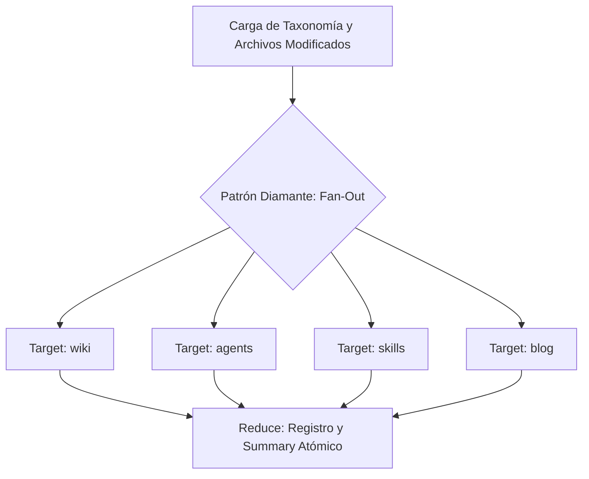

# Plan de Implementación — Spec 010: Generador Multi-Destino OpenWiki

Este documento formaliza la arquitectura y el plan de ejecución del generador de documentación multi-destino `scripts/docs-generator.mjs`.

---

## 1. Arquitectura del Motor (Patrón Diamante)

1. **Paralelismo Seguro:** Los 4 targets principales (`wiki`, `agents`, `skills`, `blog`) son 100% independientes en sus rutas de salida (`src/content/wiki/`, `AGENTS.md`, `skills-overview.md`, `src/content/blog/`).
2. **Fan-Out (`Promise.all`):** Ejecución concurrente sin costo de sobrecargas de frameworks extras. Latencia total = `max(t_wiki, t_agents, t_skills, t_blog)`.
3. **Failover Ponderado:** Rotación de LLMs en pool (`Groq` → `DashScope` → `Gemini`).

---

## 2. Cobertura de Targets

- `wiki`: Documentación de componentes, scripts y hooks en `src/content/wiki/`.
- `agents`: Resumen de capacidades en `AGENTS.md`.
- `skills`: Catálogo de habilidades registradas en `skills-overview.md`.
- `blog`: Artículos automáticos basados en taxonomía en `src/content/blog/`.
- `page`: Generador de borradores de contenido estático (`--target=page`).
