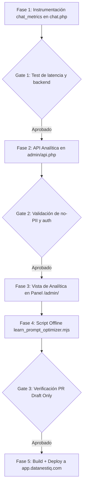

# Plan de Implementación — Spec 016: Analítica de Conversión y Loop `chat → lead → learn`

Este plan establece las fases técnicas para construir la instrumentación, la interfaz de analítica en el panel CRM y el script offline de optimización asistida del `SYSTEM_PROMPT`.

---

## Flujo de Fases y Gates Humanos

---

## Detalle de Fases de Implementación

### FASE 1 · Instrumentación de Peticiones Chat (`chat_metrics`) y Migración de BD
1. **Esquema de BD e Migración Idempotente:** Modificar `scripts/init_crm_db.php` para incorporar la tabla `chat_metrics` y sus índices, e incluir la verificación idempotente de columnas en `leads` (`sector`, `rol` vía `PRAGMA table_info` antes de `ALTER TABLE`).
2. **Actualización de `save_wizard.php`:** Extraer los campos `sector` y `rol` del contexto del payload e insertarlos en la tabla `leads`.
3. **Medición de Latencia y Proveedor:** En `public/api/chat.php`, capturar `$start_time = microtime(true);` al inicio y calcular `$latency_ms = (int)((microtime(true) - $start_time) * 1000);` al finalizar la respuesta.
4. **Registro:** Insertar en `chat_metrics` la tupla `(session_id, backend_used, latency_ms, success, tokens_est)`.
5. **Verificación:** `C:/xampp/php/php.exe -l public/api/chat.php` y `C:/xampp/php/php.exe -l public/api/save_wizard.php`.

### FASE 2 · Endpoints de Analítica Agregada (`public/admin/api.php`)
1. **Endpoints:** Agregar las acciones `action=analytics_funnel`, `action=analytics_by_dimension` y `action=analytics_llm_metrics`.
2. **Seguridad:** Requerir `auth.php` en cada acción. Validar que la respuesta retorne únicamente agregados numéricos o identificadores anonimizados (cero PII).
3. **Verificación:** `C:/xampp/php/php.exe -l public/admin/api.php`.

### FASE 3 · Interfaz de Analítica en Panel `/admin/` (`public/admin/index.php`)
1. **Componente UI:** Agregar navegación por pestañas en `/admin/` (`Leads`, `Citas`, `Analítica de Conversión`).
2. **Tarjetas de KPI:** Mostrar Tasa de Conversión a Citas (%), Tasa de Clientes Ganados (%), Latencia Promedio LLM (ms) y Volumen de Invocaciones por Proveedor.
3. **Embudo Visual:** Graficar/estructurar las 6 etapas reales del lead (`nuevo` → `contactado` → `cita_solicitada` → `ganado` → `perdido` → `no_interesado`).
4. **Trazabilidad de Journey:** En el modal de detalle del lead, mostrar la secuencia de chips de contexto + transcripción enlazada por `session_id`.

### FASE 4 · Loop `learn` Offline (`scripts/learn_prompt_optimizer.mjs`)
1. **Script CLI:** Crear script ejecutable offline `scripts/learn_prompt_optimizer.mjs`.
2. **Procesamiento Batch:** Extraer transcripciones de leads con estado `ganado` vs. `perdido`/`no_interesado`.
3. **Generación de Sugerencias:** Utilizar la API free-tier de Groq/Gemini para clasificar razones de cierre y sugerir adiciones/ajustes al `SYSTEM_PROMPT`.
4. **Integración con GitHub PRs:** Formatear la salida como propuesta de Pull Request en borrador (utilizando la infraestructura de `content-pr.yml`), **sin capacidad de auto-merge**.

### FASE 5 · Build, Pruebas, Migración Remota y Despliegue en Producción
1. **Pruebas de Compilación:** `node scripts/build-taxonomy.mjs` y `npm run build` (57+ páginas estáticas compiladas).
2. **Pruebas HTTP y Funcionales:** Validar endpoints de analítica y visualización de panel bajo HTTPS.
3. **Migración de Producción (DB Viva):**
   - Ejecutar backup preventivo en el servidor remoto antes del deploy (`cp secure_leads/crm.sqlite secure_leads/crm.sqlite.bak`).
   - Ejecutar la migración idempotente de `init_crm_db.php` remotamente con `/usr/bin/php8.2-cli` garantizando la preservación completa de leads preexistentes.
4. **Despliegue a Producción:** `python scripts/deploy/deploy_ionos.py --confirm --init-crm` al subdominio `app.datanestiq.com`.
4. **Doc-Sync (Constitución §11):** Sincronizar documentación con `npm run docs:sync`.

---

## Plan de Verificación

- `C:/xampp/php/php.exe -l public/api/chat.php`
- `C:/xampp/php/php.exe -l public/admin/api.php`
- `node scripts/build-taxonomy.mjs`
- `npm run build`
- Pruebas `curl` de respuestas agregadas en `/admin/api.php` comprobando ausencia de PII.
